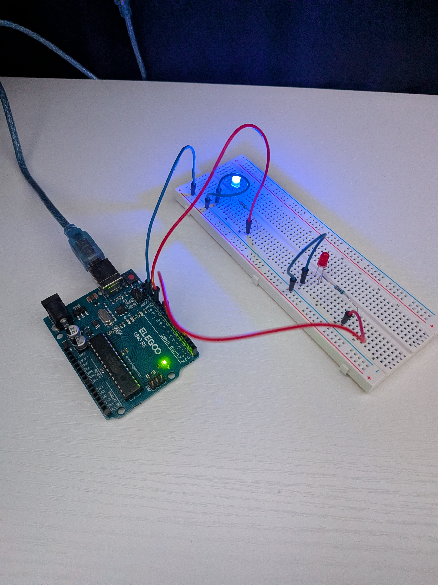
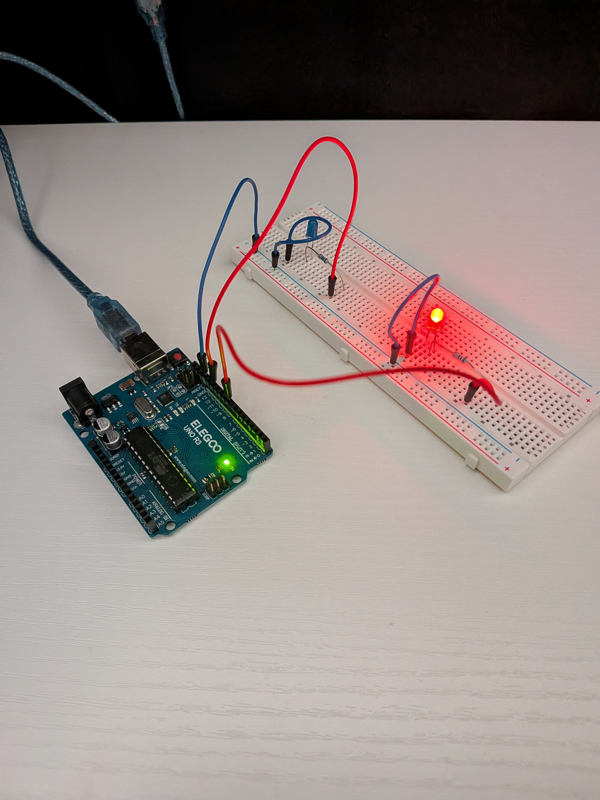

# Project 2: Two LED Alternate Blink

Two LEDs (pins 12 and 8) blinking in an alternating pattern using `digitalWrite()` and `delay()`.

 

## v1 — first attempt
See [two-led-alternate-v1.ino](./two-led-alternate-v1.ino)

My first version turned on LED 12, waited, turned on LED 8 (without turning off LED 12 first), waited, turned off LED 12, waited, then turned off LED 8. When I traced through the timing, I realized this wasn't a true alternate — there was a phase where both LEDs were on at once, and a phase where both were off, before it repeated.

## v2 — fixed
See [two-led-alternate-v2.ino](./two-led-alternate-v2.ino)

Fixed it so both `digitalWrite()` calls happen together at each step — LED 12 ON while LED 8 OFF, then swap. No overlap, no gap.

```cpp
void loop() {
  digitalWrite(12, HIGH);
  digitalWrite(8, LOW);
  delay(1000);
  digitalWrite(12, LOW);
  digitalWrite(8, HIGH);
  delay(1000);
}
```

## What I learned
- Order and pairing of `digitalWrite()` calls matters — turning one pin HIGH before setting the other LOW creates a brief state where both are on
- Tracing through code with a timeline (what's HIGH/LOW at each second) is the fastest way to catch logic bugs before ever touching the breadboard
- A "working" circuit (LEDs blinking) can still be wrong if the pattern doesn't match what you actually intended

## Next step
Rewrite this using `millis()` instead of `delay()`, then add a button to change the blink speed without blocking the rest of the program.
