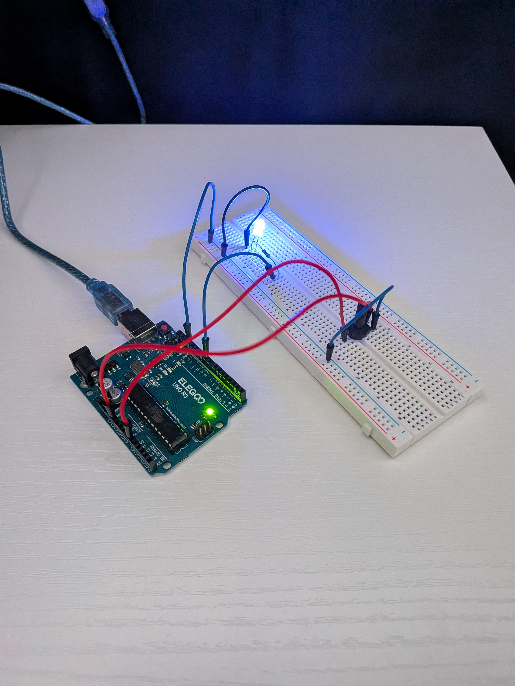

# Project 3: Potentiometer LED Speed Control

An LED whose blink speed changes in real time based on a potentiometer, using `analogRead()` and `map()`.

See [potentiometer-led.ino](./potentiometer-led.ino) for the code.

## How it works
The potentiometer's wiper is connected to A0. Every loop cycle, `analogRead(potPin)` reads its current position (0-1023), and `map()` converts that raw range into a usable delay time (100-1000ms). That delay controls how long the LED stays on and off, so turning the knob changes the blink speed live.

## Debugging along the way
My first draft had a few issues I had to work through:
- Two `const int` declarations chained on one line with a comma instead of separate statements — each needs its own line and semicolon
- Called `analogRead(potPin, 0)` — didn't realize `analogRead()` only takes one argument (the pin), not two
- Forgot to store the result of `analogRead()` and `map()` into variables, so the values were being calculated and immediately thrown away instead of used
- A few missing semicolons that kept the sketch from compiling

## What I learned
- `analogRead()` returns a raw value (0-1023) that needs to be captured in a variable to be used later in the code
- `map()` takes 5 arguments — the value to convert, its current range, and the target range — and rescales proportionally
- Reading the potentiometer *inside* `loop()` (not `setup()`) is what makes the speed update live, since `loop()` re-runs continuously and grabs a fresh reading every cycle

## Next step
Try adding a second potentiometer or button so I can control both blink speed and which LED blinks, combining multiple inputs at once.
