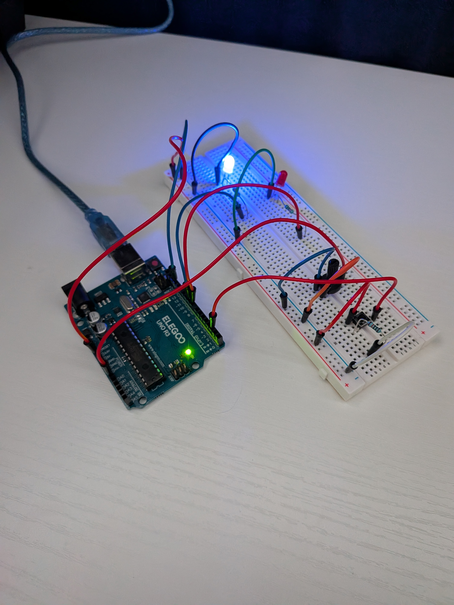

# Project 4: Button-Controlled LED Select with Potentiometer Speed

Two LEDs, but only one blinks at a time. A button press switches which LED is active, and the potentiometer still controls blink speed for whichever LED is currently selected.

See [button-led-select.ino](./button-led-select.ino) for the code.

## How it works
- `activeLED` is a variable holding either pin 9 or pin 8 — whichever LED is currently "selected"
- Every loop cycle, the button's current state is compared against its state from the *previous* cycle. Only when it goes from LOW to HIGH (the exact moment a press begins) does `activeLED` toggle to the other pin — this stops it from switching hundreds of times while the button is held down
- The potentiometer + `map()` logic from Project 3 is unchanged, just now applied to whichever pin `activeLED` currently holds

## Problems I ran into
- Used `=` instead of `==` when first trying to write the button comparison — `=` assigns a value instead of comparing, which would have silently broken the logic without an obvious error
- Forgot to update `lastButtonState` at the end of the loop — without that line, the "previous state" never updates, so a new press would never register correctly after the first one
- Accidentally deleted my in-progress sketch partway through and had to rebuild it from scratch, which turned out to be a good check that I actually understood each piece rather than just having working code

## What I learned
- Edge detection (catching the *moment* a value changes, not just its current state) requires tracking state between loop cycles, not just checking the current reading
- `==` compares, `=` assigns — mixing these up is an easy, hard-to-spot bug since it often doesn't cause a compile error
- Building on a previous project's code (Project 3's potentiometer logic) instead of starting over saved a lot of time and reduced new bugs to just the new feature

## Next step
Add a third LED and cycle through all three with the button instead of just toggling between two, which would require tracking active state as a number/index instead of just swapping between two fixed pins.
